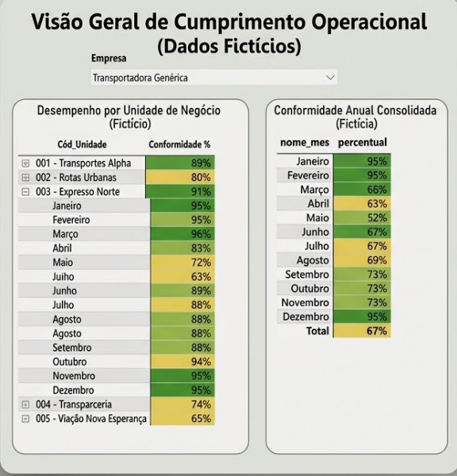
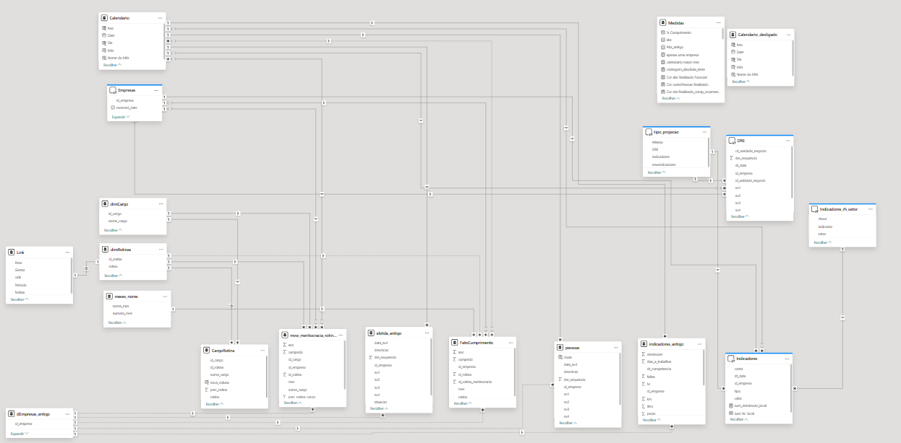
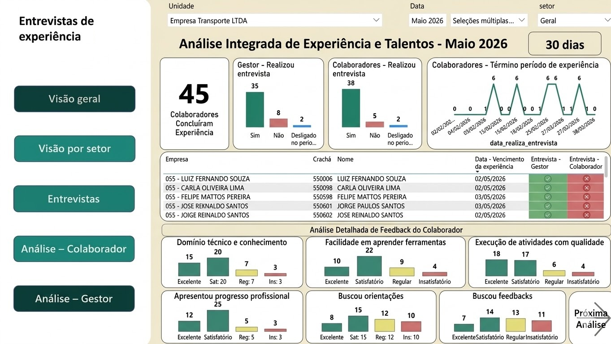

# 📊 Portfólio de Dashboards

Bem-vindo ao meu portfólio!  
Aqui apresento alguns dos principais painéis que desenvolvi, incluindo modelagem de dados, construção de métricas e manutenção de pipelines analíticos.

---

## 📈 Dashboard de Rotinas por Empresa

**Objetivo:**  
Acompanhar o cumprimento de rotinas por empresa ao longo do tempo.

**Descrição:**  
- Modelagem com tabela de empresas e calendário (DAX)
- Cálculo de percentuais baseado na média de cumprimento
- Monitoramento em tempo real para gestores

**Resultado:**  
Permite visão clara de responsabilidade e performance operacional por empresa.

---

## 🧩 Modelagem de Dados e Relacionamentos

**Objetivo:**  
Garantir consistência e coerência nas análises do BI.

**Descrição:**  
- Estruturação do modelo relacional entre tabelas
- Definição de chaves e cardinalidade
- Garantia de contexto analítico entre páginas

**Resultado:**  
Base sólida para dashboards confiáveis e escaláveis.

---

## 👥 Análise do Período de Experiência

**Objetivo:**  
Avaliar o desempenho e adaptação de novos colaboradores.

**Descrição:**  
- Integração com dados do ERP e questionários internos
- Monitoramento de entrevistas obrigatórias
- Análise de feedbacks de gestores e colaboradores

**Resultado:**  
Insights estratégicos para o RH atuar nos principais pontos de melhoria.

---

## 📉 Entrevistas de Desligamento

**Objetivo:**  
Analisar padrões e causas de desligamento.

**Descrição:**  
- Monitoramento da execução dos processos de RH
- Análise de indicadores como:
  - Turnover
  - Absenteísmo
- Exploração qualitativa das respostas

**Resultado:**  
Apoio à tomada de decisão para retenção e melhoria organizacional.

---

## ⚠️ Observação

> Os dados apresentados foram modificados com o uso de inteligência artificial para preservar a confidencialidade das empresas envolvidas.